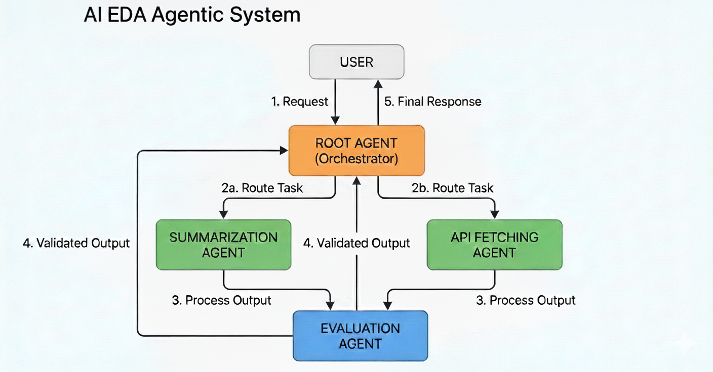

---

## System Diagram



---

## Overview: LLM Tool Calling vs No Tool Calling


---
## 1️⃣ LLM **without tool calling**

* It **only generates text** based on the prompt.
* Example: you ask, *“What’s the current temperature in Paris?”*

  * LLM will **guess or hallucinate** a number.
  * It has **no way to indicate structured tool calls**, no awareness of external functions.
* Output is purely **unstructured natural language**.

**Example:**

```
User: What's the temperature in Paris?
LLM: It's about 25 degrees Celsius.  # Could be wrong, no function executed
```

---

## 2️⃣ LLM **with tool calling**

* LLM can **output structured instructions** that represent “tool calls” (functions it *wants* to invoke).
* Example: it produces a JSON describing which tool to call and with what arguments:

```json
{
  "name": "get_current_temperature",
  "arguments": {"location": "Paris, France", "unit": "celsius"}
}
```

* Your program (or an agent) reads this, executes the tool, and feeds the result back.
* This allows LLMs to **interact with external systems** in a safe, controlled way.

**Example flow:**

```
1️⃣ LLM: {"name": "get_current_temperature", "arguments": {...}}
2️⃣ Your code: executes get_current_temperature()
3️⃣ Result: 22.0
4️⃣ LLM: "The current temperature in Paris is 22°C."
```

---

### 🔹 Key difference

| Feature                             | No Tool Calling | Tool Calling                           |
| ----------------------------------- | --------------- | -------------------------------------- |
| Structured function output          | ❌               | ✅                                      |
| Access to external APIs / functions | ❌               | ✅ (via orchestrator)                   |
| Accuracy for real-world data        | ❌ hallucinates  | ✅ can return actual data               |
| Interaction format                  | Text only       | JSON / tool calls / structured outputs |

---

### One-line takeaway

> **Tool calling doesn’t let the LLM execute functions by itself** — it just lets the LLM **plan and suggest structured calls** to external systems -

---
