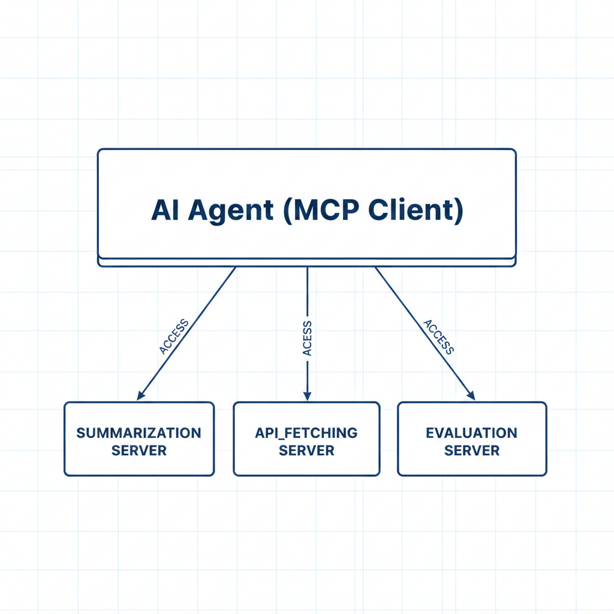

# AI EDA Project

## Table of Contents
- [Tasks Block Diagrams](#tasks-block-diagrams)
  - [Task 1: Multi-Agent Orchestration](#task-1-multi-agent-orchestration)
  - [Task 2: MCP-Based Architecture](#task-2-mcp-based-architecture)
  - [Task 3: Automated Web Extraction & Summarization](#task-3-automated-web-extraction--summarization)

## Tasks Block Diagrams

### Task 1: Multi-Agent Orchestration

Here is Video demo for task1:
**[🎥 Video Demo](https://drive.google.com/drive/folders/1uXNnznjzD2D28ZOuSagtw4vlr_1t7Arh?usp=sharing)**

Here is readme for task1:
**[📖 Task 1 README](code/task1/TASK1_README.md)**

----------------------------------------------------------------------

For Task 1, we developed a modular multi-agent system where each specific responsibility is handled by a dedicated agent. This architecture ensures clear separation of concerns:
- **Modular Design**: Each agent (API Fetching, Summarization, and Evaluation) is equipped with its own set of specialized **tools** and a dedicated **prompt file** for precise behavioral control.
- **Framework**: The system is built using the **Google-adk** framework, leveraging its capabilities for robust agent management and tool integration.

---

### Task 2: MCP-Based Architecture

Here is Video demo for task2:
**[🎥 Video Demo](https://drive.google.com/drive/folders/1k71ECXFs60-UV4GMh4_O5hjWCU7wob_E?usp=drive_link)**

Here is readme for task2:
**[📖 Task 2 README](code/task2/TASK2_README.md)**

----------------------------------------------------------------------

Task 2 transitions the system to a Model Context Protocol (MCP) architecture, enhancing scalability and interoperability:
- **MCP Client**: A single agent acts as the MCP client, orchestrating requests across the environment.
- **MCP Servers**: Three distinct servers provide specialized services:
    1. **API Fetching Server**
    2. **Summarization Server**
    3. **Evaluation Server**

> **Note on Evaluation Logic**: The Evaluation Server is exclusively responsible for assessing the **summarization output**. We have omitted automated evaluation for the API fetching stage because the fetching server interacts directly with the ground truth (real API data). Evaluating the raw fetching output against itself would be redundant, as the server's primary role is to provide the factual data used in subsequent steps.

---

### Task 3: Automated Web Extraction & Summarization

Here is Video demo for Task3:
**[🎥 Video Demo](https://drive.google.com/drive/folders/1JeiAw2mVzMdtRNwNHd4MqMbLqAJQLYAe?usp=drive_link)**

Here is readme for task3:
**[📖 Task 3 README](task3/TASK3_README.md)**

Task 3 focuses on automated data extraction from live web sources and processing via MCP:
- **Architecture**: The system consists of **1 MCP Client** and **1 MCP Server** dedicated to summarization.
- **Automation Layer**: We implemented **4 Playwright-based test scripts** to automate content extraction from the Wikipedia "Artificial Intelligence" article:
    1. **Baseline Test (`test_baseline.py`)**: Extracts and summarizes the "Applications" section.
    2. **History Test (`test_history.py`)**: Extracts and summarizes the "History" section to ensure thematic consistency.
    3. **Full Article Test (`test_full_article.py`)**: Extracts the entire article to test the LLM's ability to handle large context windows and high compression ratios.
    4. **Robustness Test (`test_empty_content.py`)**: Verifies that the system handles missing or non-existent sections gracefully without crashing.
