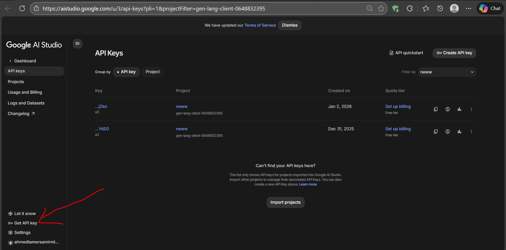

# Task 2: MCP-Based Architecture

This task transitions the multi-agent system to a Model Context Protocol (MCP) architecture, enhancing scalability and interoperability by decoupling the client from the specialized services.

## Architecture

The system is built around a central MCP Client that orchestrates requests across multiple specialized MCP Servers:

1.  **MCP Client (`agent.py`)**: A single `LlmAgent` that acts as the orchestrator. It uses `McpToolset` to connect to various servers and route user requests based on their intent.
2.  **Summarization Server (`summarization_server.py`)**: Provides tools for:
    -   `extract_pdf_text`: Extracting raw text from PDF documents.
    -   `detect_language`: Identifying the language of a given text.
    -   `summarize_text`: Summarizing provided text.
    -   `summarize_pdf`: A high-level tool for end-to-end PDF summarization.
3.  **API Fetching Server (`api_fetching_server.py`)**: Provides tools for:
    -   `fetch_weather`: Retrieving real-time weather data.
    -   `fetch_exchange_rate`: Retrieving current currency exchange rates.
4.  **Evaluation Server (`evaluation_server.py`)**: Responsible for assessing the quality of the summarization output, ensuring accuracy and detecting hallucinations.

> **Note on Evaluation Logic**: The Evaluation Server is exclusively responsible for assessing the **summarization output**. We have omitted automated evaluation for the API fetching stage because the fetching server interacts directly with the ground truth (real API data). Evaluating the raw fetching output against itself would be redundant, as the server's primary role is to provide the factual data used in subsequent steps.

## Technologies & Models Used

| Category | Technology/Model | Purpose/Usage |
|----------|------------------|---------------|
| **Framework** | Google-adk (Agent Development Kit) | Core framework for MCP client-server architecture |
| **Protocol** | Model Context Protocol (MCP) | Enables decoupled client-server communication |
| **LLM Models** | Gemini 2.5 Flash | Main MCP client agent for orchestration and routing |
| | Gemini 2.5 Flash Lite | Used in `summarize_text` tool within the summarization server |
| | Gemini 3 Flash Preview | Judge LLM used in `hallucination_checker` tool within the evaluation server |
| **External APIs** | Weather API | For weather data retrieval |
| | Currency Exchange API | For exchange rate data |
| **Document Processing** | PyMuPDF (fitz) | PDF text extraction in summarization server |
| **Programming Language** | Python 3.x | Primary development language |

## Directory Structure

- [agent.py](code/task2/agent.py) - The main MCP client agent.
- [api_fetching_server.py](code/task2/api_fetching_server.py) - MCP server for external API data.
- [evaluation_server.py](code/task2/evaluation_server.py) - MCP server for output validation.
- [summarization_server.py](code/task2/summarization_server.py) - MCP server for document processing.
- [system_prompt.py](code/task2/system_prompt.py) - System instructions for the MCP agent.
- **output/** - Directory will be created in runtime for storing execution results and logs.

## How to Run Task 2

### Dependencies
1. Create virtual environment
2. Install [requirements.txt](../../requirements.txt)

### API KEY Configuration

1. Use the existing [`.env` file](../../.env)
2. Go to [Google AI Studio](https://aistudio.google.com/) and create your Gemini API key
3. 
4. Add your Gemini API key to the `.env` file:

### Running MCP System
1. Execute `configure_root.py` and choose the MCP agent option.
2. Ensure that the Python path of your virtual environment is correctly set in `PYTHON_EXECUTABLE` in `agent.py`.
3. Navigate to the `code` directory.
4. Run `adk web` in the terminal.
5. From the ADK web UI, select "task2" from the drop-down menu.
6. Start chatting with the MCP agent.
